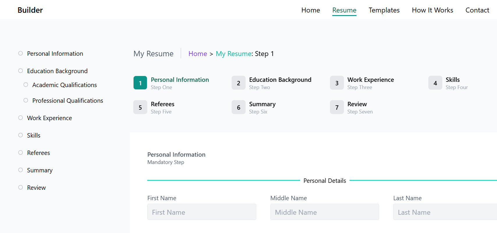
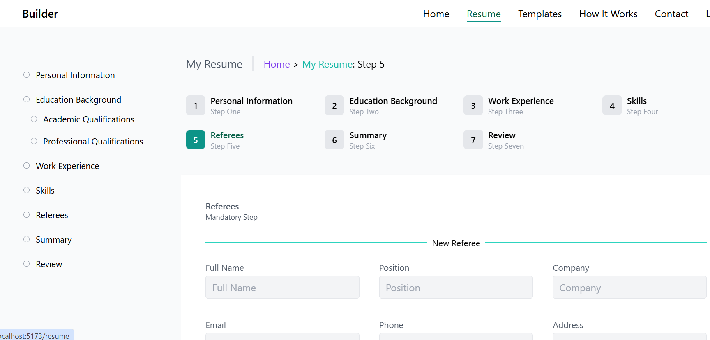

# Resume Builder

A web application that allows users to easily create and manage their resumes. This project is built with React for the frontend and PocketBase for the backend to store and manage user data.

## Features

- ✅ User registration and authentication.
- ✅ Create, and update resume.
- ✅ Add personal details, education, experience, skills, and more.
- ❌ Export resumes in PDF format.
- ✅ Data is stored securely using PocketBase.

## Tech Stack

- **Frontend**: React.js and Tailwind CSS
- **Backend**: PocketBase (for user authentication and data storage)
- **PDF Export**: [pdfmake](https://github.com/bpampuch/pdfmake)

## Installation

### Prerequisites

- Node.js (v16.x or later)
- PocketBase server running locally or in the cloud

### Setup

1. Clone the repository:

   ```bash
   git clone https://github.com/theomaro/resume-builder.git
   ```

2. Install dependencies:

   ```bash
   cd resume-builder
   npm install
   ```

3. Set up PocketBase:

   - Download and run PocketBase on your local machine or use a hosted version.
   - Set up a PocketBase instance to manage your users and resume data.

4. Start the Pocketbase Backend server:

`Important Note`: You must configure the pocketbase server for your operating system

- Download pocketbase
- Create `pb` directory on the root directory
- Extract pocketbase inside the `pb` directory
- Finally run the pocketbase server

  ```
  $ cd pd
  $ ./pocketbase.exe serve
  ```

5. Start the React development server:

   ```bash
   npm run dev
   ```

6. Access the app by navigating to `http://localhost:5173/` in your browser.

## Usage

- **Create an account**: Register an account to get started.
- **Create a new resume**: After logging in, you can add a new resume by filling out the form with your personal information, education, experience, and skills.
- **Edit your resume**: Modify or update existing resume entries.
- **Export to PDF**: Once your resume is ready, you can download it as a PDF.

## Demo

- Personal Information
  
- Education Background
  
- Referees
  
